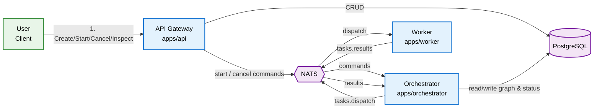
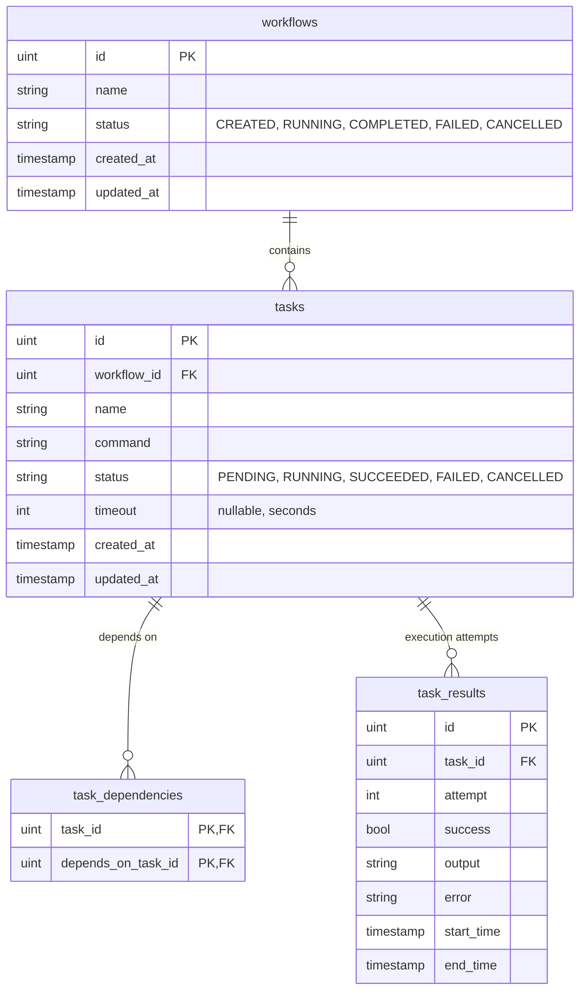

# 🔄 TaskFlow: A Distributed Workflow Orchestration System

> **A modern, scalable microservices-based system for DAG-based workflow orchestration**

[](https://golang.org/)

TaskFlow is a **microservices ecosystem** built in Go for defining, executing, and monitoring workflows made of interdependent tasks. A workflow is a **Directed Acyclic Graph (DAG)** of tasks: the Orchestrator resolves the graph, dispatches ready tasks to Workers over NATS, and reacts to their results to progress, retry, complete, fail, or cancel the workflow.

## 🏗️ High-Level Architecture



### 📋 Domain Model



## 🧩 Core Components

### 🚀 Microservices (`apps/`)

#### 🌐 **API Gateway** (`apps/api`)
> *The system's front door for workflow management*

Implements the 5 supported use cases as a REST API:

| Use Case | Endpoint |
|----------|----------|
| Create Workflow (validates the task graph, incl. cycle detection) | `POST /api/v1/workflows` |
| Start Workflow (async, returns `202 Accepted`) | `POST /api/v1/workflows/{id}/start` |
| Get Workflow Status | `GET /api/v1/workflows/{id}` |
| Get Task Results | `GET /api/v1/tasks/{taskId}/results` |
| Cancel Workflow (async, returns `202 Accepted`) | `POST /api/v1/workflows/{id}/cancel` |

Create/Status/Results are handled directly against PostgreSQL. Start/Cancel are delegated to the Orchestrator over NATS.

#### 🧠 **Orchestrator** (`apps/orchestrator`)
> *The orchestration engine — absorbs the responsibilities of the former `scheduler` and `notifier` services*

- Resolves the `TaskDependency` DAG and dispatches every `PENDING` task whose dependencies have all `SUCCEEDED`.
- Consumes task results, retries failed tasks up to `orchestrator.max_attempts`, and fails the workflow (cancelling remaining tasks) when a task can no longer be retried.
- Completes the workflow once every task has `SUCCEEDED`.
- Reacts to `start`/`cancel` commands published by the API Gateway.

See [apps/orchestrator/README.md](./apps/orchestrator/README.md) for subject-level details.

#### ⚡ **Worker** (`apps/worker`)
> *The execution engine*

- Consumes dispatched tasks from NATS (`tasks.dispatch`, queue group `workers`).
- Executes each task's shell command with a per-task or default timeout.
- Publishes the outcome to `tasks.results` for the Orchestrator to process.

### 📚 Shared Libraries (`pkg/`)

- **`pkg/messaging`** — `Broker` abstraction over NATS (`Publish`, `Subscribe`, `QueueSubscribe`), with a synchronous in-memory `MockBroker` for tests.
- **`pkg/persistence`** — GORM-based PostgreSQL connection, migrations, and the `RepositoryInterface` used by the API Gateway and Orchestrator (with a `MockRepository` for tests).
- **`pkg/tfutil`** — small generic helpers.

### 🗺️ State Machines

**Workflow:** `CREATED → RUNNING → {COMPLETED, FAILED, CANCELLED}`, plus `CREATED → CANCELLED`.

**Task:** `PENDING → {RUNNING, CANCELLED}`; `RUNNING → {SUCCEEDED, FAILED, CANCELLED}`; `FAILED → {RUNNING (retry), CANCELLED}`.

### 🛠️ Deployment Configuration (`deployments/`)

- **Prometheus** (`deployments/prometheus/`) — service health and performance monitoring.

## 🔄 Workflow Lifecycle

| Step | Component | Action |
|------|-----------|--------|
| **1** | 👤 **User** | `POST /api/v1/workflows` — define tasks + dependencies |
| **2** | 🌐 **API** | Validate the graph (cycles, duplicate/unknown refs), persist Workflow (`CREATED`) + Tasks (`PENDING`) + dependencies |
| **3** | 👤 **User** | `POST /api/v1/workflows/{id}/start` |
| **4** | 🌐 **API** | Publish `workflow.commands.start`, return `202 Accepted` |
| **5** | 🧠 **Orchestrator** | Transition workflow to `RUNNING`, dispatch every root task (no dependencies) |
| **6** | ⚡ **Worker** | Consume dispatched task, execute its command, publish the result |
| **7** | 🧠 **Orchestrator** | Persist the result; on success mark the task `SUCCEEDED` and dispatch newly-ready dependents; on failure retry or fail the workflow |
| **8** | 🧠 **Orchestrator** | Once every task has `SUCCEEDED`, mark the workflow `COMPLETED` |
| **9** | 👤 **User** | `GET /api/v1/workflows/{id}` and `GET /api/v1/tasks/{taskId}/results` to inspect progress and outcomes at any time |

## 🚀 Quick Start

```bash
# Clone the repository
git clone https://github.com/hhace/taskflow.git
cd TaskFlow

# Start the entire stack
docker-compose up -d

# Check service health
curl http://localhost:8081/health       # API Gateway
curl http://localhost:8084/health       # Orchestrator
curl http://localhost:8082/health       # Worker
```

---
*Documentation is generated with the use of GitHub Copilot*
