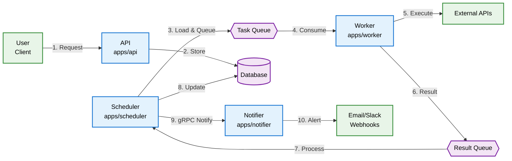
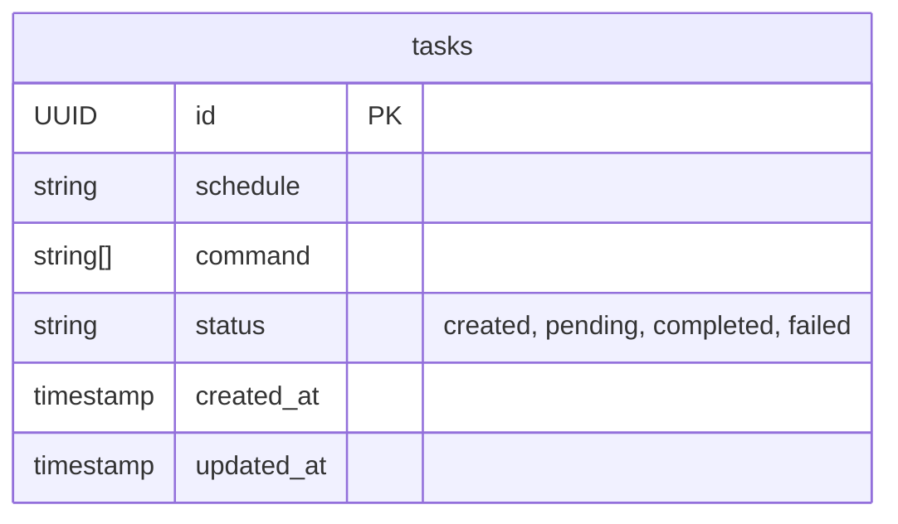

# 🔄 TaskFlow: A Distributed Task Scheduling System

> **A modern, scalable microservices-based system for distributed task orchestration**

[](https://golang.org/)

TaskFlow is a **production-ready microservices ecosystem** built in Go for scheduling, executing, and monitoring distributed tasks. Designed with **scalability**, **resilience**, and **observability** at its core, using NATS for asynchronous task queuing and gRPC for synchronous inter-service communication (Scheduler→Notifier).

## 🏗️ High-Level Architecture

The platform consists of **specialized microservices** that communicate via NATS message queues for task distribution and gRPC for notification delivery, ensuring robust, fault-tolerant task processing.

### 📊 System Architecture


### 📋 DB Schema

### 🧩 Core Components

### 🚀 Microservices (`apps/`)
Each service is a specialized, independently deployable component:

#### 📅 **API** (`apps/api`) 
> *The system's front door for task management*

- **Authentication & Authorization** - JWT validation and user management
- **Request Validation** - Input sanitization and schema validation  
- **Rate Limiting** - Traffic control and abuse prevention
- **RESTful API** - HTTP endpoints for all task operations
- **Task Validation** - Business logic and constraint checking
- **Persistence Management** - Database operations and state tracking

#### ⏰ **Scheduler** (`apps/scheduler`)
> *The orchestration brain and result aggregator*

- **Cron-based Scheduling** - Automatic task triggering based on schedules
- **Queue Publishing** - Message broker integration for task dispatch
- **Result Processing** - Task outcome analysis and storage
- **Status Management** - Real-time state updates and history tracking
- **Dynamic Task Loading** - Periodic refresh of scheduled tasks from database

#### ⚡ **Worker** (`apps/worker`)
> *The execution engine*

- **Queue Consumption** - Real-time task processing from message queues
- **Task Execution** - Pluggable task handlers for diverse workloads
- **Result Publishing** - Status updates and output data management
- **Error Handling** - Retry logic and failure recovery mechanisms

#### 🔔 **Notifier** (`apps/notifier`)
> *The communication gateway*

- **Multi-channel Delivery** - Email, Slack, webhooks, and more
- **Event Processing** - Smart filtering and routing based on conditions
- **Delivery Confirmation** - Reliable notification with retry mechanisms
- **Template Management** - Customizable message formatting

---

### 📚 Shared Libraries (`pkg/`)
Reusable components across all services:

#### 🔐 **Authentication** (`pkg/auth`)
- JWT token generation, validation, and middleware
- Role-based access control (RBAC) utilities
- Session management and security helpers

---

### 🔌 Integration Layer

#### 📋 **Protocol Definitions** (`proto/`)
> *gRPC contracts for Scheduler→Notifier communication*

- **gRPC Service Definitions** - Type-safe notification API specifications
- **Message Schemas** - Structured notification event contracts
- **Code Generation** - Auto-generated client/server stubs for notification service
- **Version Management** - Backward-compatible API evolution

#### 🗄️ **Database Migrations** (`migrations/`)
- **Schema Evolution** - Version-controlled database changes
- **Data Migrations** - Safe data transformation scripts
- **Rollback Support** - Reversible database operations

#### 🛠️ **Deployment Configuration** (`deployments/`)

##### 📊 **Prometheus Setup** (`deployments/prometheus/`)
- **Metrics Collection** - Service health and performance monitoring
- **Alerting Rules** - Proactive issue detection and notification
- **Dashboard Configuration** - Grafana integration and visualization

## 🔄 Task Lifecycle & Data Flow

> **End-to-end journey of a task through the TaskFlow ecosystem**

### 📋 Process Overview

```
User Request → Authentication → Scheduling → Persistence → Execution → Aggregation → Notification
```

### 🔢 Detailed Flow Steps

| Step | Component | Action | Description |
|------|-----------|--------|-------------|
| **1** | 👤 **User** | `HTTP Request` | Client submits task creation request |
| **2** | 🌐 **API** | `Authentication` | JWT validation via `pkg/auth` |
| **3** | 🌐 **API** | `Validate & Store` | Task validation, ID assignment, DB persistence (`created` status) |
| **4** | ⏰ **Scheduler** | `Load & Schedule` | Periodically loads `created` tasks and schedules via cron |
| **5** | ⏰ **Scheduler** | `Queue Dispatch` | Publish task message to **Task Queue** when due, update to `pending` |
| **6** | ⚡ **Worker** | `Consume & Execute` | Pick up task, execute business logic |
| **7** | ⚡ **Worker** | `External Integration` | Call external APIs, process data, perform work |
| **8** | ⚡ **Worker** | `Publish Result` | Send outcome (success/failure/logs) to **Result Queue** |
| **9** | ⏰ **Scheduler** | `Process Result` | Consume result, update final status (`completed`/`failed`) |
| **10** | ⏰ **Scheduler** | `Store Logs` | Persist execution logs and task history |
| **11** | ⏰ **Scheduler** | `gRPC Call` | Send notification request to Notifier via gRPC (synchronous, type-safe) |
| **12** | 🔔 **Notifier** | `Send Alert` | Deliver notifications via email, Slack, webhooks |

### 🔍 Continuous Monitoring

Throughout the entire lifecycle, **Prometheus** continuously scrapes `/metrics` endpoints from all services, providing:

- 📊 **Real-time Metrics** - Performance, throughput, and health indicators
- 🚨 **Alerting** - Proactive issue detection and escalation
- 📈 **Dashboards** - Visual monitoring and operational insights
- 🔍 **Troubleshooting** - Detailed logs and trace correlation

---

## 🚀 Quick Start

```bash
# Clone the repository
git clone https://github.com/Hhacel/TaskFlow.git
cd TaskFlow

# Start the entire stack
docker-compose up -d

# Check service health
curl http://localhost:8081/health
```
---
*Documentation are generated with use of Github Copilot*