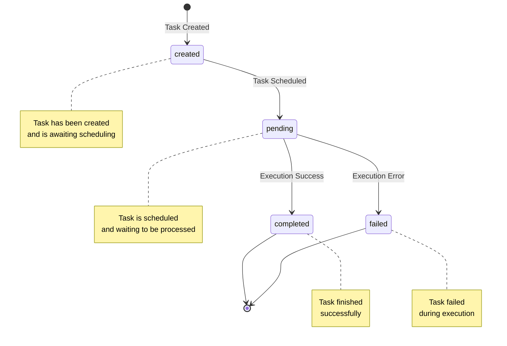

# TaskFlow API

The API service is the main entry point for the TaskFlow system. It handles all incoming HTTP requests, authenticates users, validates input, and manages task CRUD operations and persistence.

## OpenAPI Code Generation

This service uses [oapi-codegen](https://github.com/oapi-codegen/oapi-codegen) to generate Go code from OpenAPI specifications.

### Prerequisites

Install the `oapi-codegen` CLI tool:
```bash
go install github.com/oapi-codegen/oapi-codegen/v2/cmd/oapi-codegen@latest
```

### Generate API Code

From the api directory, run:
```bash
# Generate all API code (types, server interfaces)
make generate

# Or generate specific parts
make types   # Generate only types
make server  # Generate only server interfaces
```

### View API Documentation

The OpenAPI specification is available at `api/openapi.yaml`. You can:

1. View it directly in any OpenAPI-compatible viewer
2. Use tools like Swagger UI or Postman to import the spec
3. The generated code provides type-safe interfaces

## API Endpoints

### Health Check
- `GET /health` - Check service health status

### Task Management
- `POST /api/v1/tasks` - Create a new task
- `GET /api/v1/tasks` - List all tasks (with optional status filter)
- `GET /api/v1/tasks/{id}` - Get a specific task by ID
- `GET /api/v1/stats` - Get task statistics

## Request/Response Examples

### Create Task
```bash
curl -X POST http://localhost:8081/api/v1/tasks \
  -H "Content-Type: application/json" \
  -d '{
    "schedule": "0 */5 * * * *",
    "command": ["echo", "hello world"]
  }'
```

### Get Tasks
```bash
# Get all tasks
curl http://localhost:8081/api/v1/tasks

# Get tasks by status
curl http://localhost:8081/api/v1/tasks?status=pending
```

## Schema

### Task Statuses
- `created` - Task has been created and is awaiting scheduling
- `pending` - Task is scheduled and waiting to be processed
- `completed` - Task finished successfully
- `failed` - Task failed during execution

#### Task State Diagram


### Cron Expression Format
The schedule field uses standard cron expression format:
```
* * * * * *
│ │ │ │ │ │
│ │ │ │ │ └─ Day of week: * (every day)
│ │ │ │ └─── Month: * (every month)
│ │ │ └───── Day of month: * (every day)
│ │ └─────── Hours: * (every hour)
│ └───────── Minutes: * (every minute)
└────────────── Seconds: */30 (every 30 seconds)
```

Examples:
- `0 */5 * * * *` - Every 5 minutes
- `0 0 9 * * MON-FRI` - Every weekday at 9 AM
- `0 30 14 * * *` - Every day at 2:30 PM