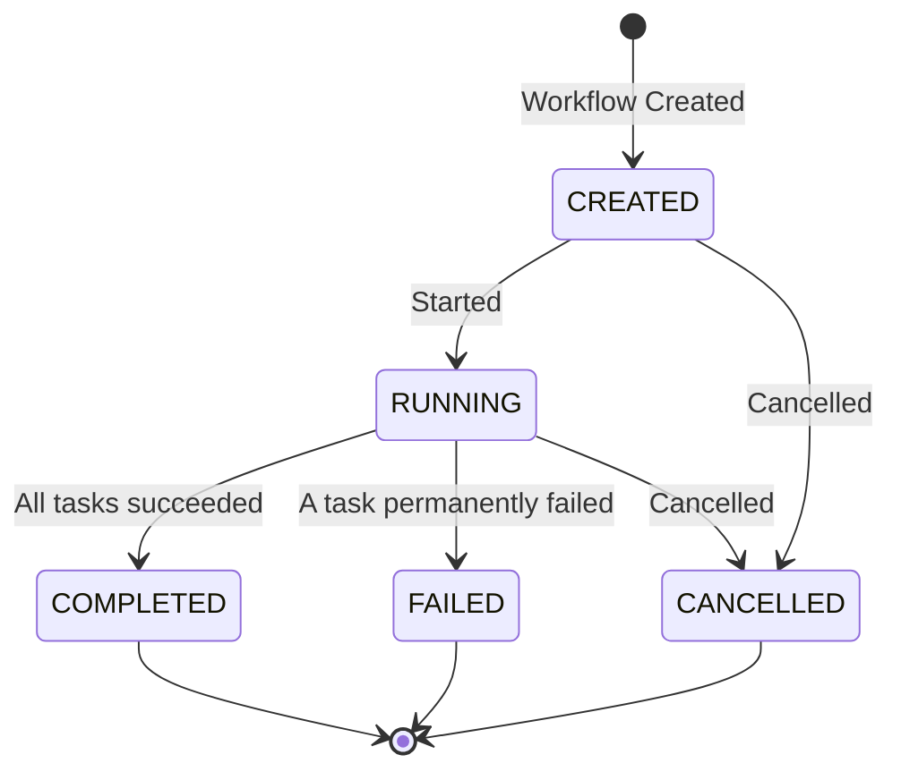

# TaskFlow API Gateway

The API Gateway is the main entry point for the TaskFlow system. It handles all incoming HTTP requests: it validates and persists workflow definitions directly against PostgreSQL, and delegates process-control decisions (start/cancel) to the Orchestrator over NATS.

## API Endpoints

### Health Check
- `GET /health` - Check service health status

### Workflow Management

| Use Case | Method & Path |
|----------|---------------|
| Create Workflow | `POST /api/v1/workflows` |
| Start Workflow | `POST /api/v1/workflows/{id}/start` |
| Get Workflow Status | `GET /api/v1/workflows/{id}` |
| Cancel Workflow | `POST /api/v1/workflows/{id}/cancel` |
| Get Task Results | `GET /api/v1/tasks/{taskId}/results` |

See [openapi/taskflow.yaml](./openapi/taskflow.yaml) for the full OpenAPI specification.

## Request/Response Examples

### Create Workflow
```bash
curl -X POST http://localhost:8081/api/v1/workflows \
  -H "Content-Type: application/json" \
  -d '{
    "name": "example-workflow",
    "tasks": [
      { "ref": "a", "name": "task-a", "command": "echo a" },
      { "ref": "b", "name": "task-b", "command": "echo b", "depends_on": ["a"] }
    ]
  }'
```

### Start Workflow
```bash
curl -X POST http://localhost:8081/api/v1/workflows/1/start
```

### Get Workflow Status
```bash
curl http://localhost:8081/api/v1/workflows/1
```

### Get Task Results
```bash
curl http://localhost:8081/api/v1/tasks/1/results
```

### Cancel Workflow
```bash
curl -X POST http://localhost:8081/api/v1/workflows/1/cancel
```

## Schema

### Workflow Statuses
`CREATED → RUNNING → {COMPLETED, FAILED, CANCELLED}` (also `CREATED → CANCELLED`)

### Task Statuses
`PENDING → {RUNNING, CANCELLED}`; `RUNNING → {SUCCEEDED, FAILED, CANCELLED}`; `FAILED → {RUNNING (retry), CANCELLED}`

#### Workflow State Diagram

