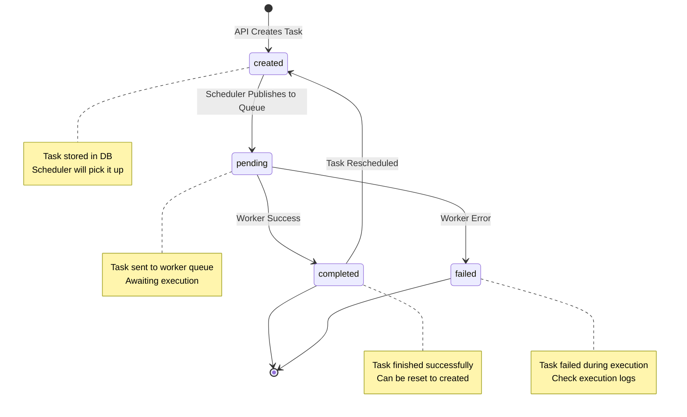

# TaskFlow Scheduler

# TaskFlow Scheduler

The Scheduler service is the orchestration brain of TaskFlow. It manages cron-based task scheduling, publishes tasks to NATS queues when due, and aggregates execution results from workers. It maintains the task lifecycle from scheduling to completion.

## Core Responsibilities

### Task Scheduling
- **Cron-based Scheduling**: Uses `robfig/cron/v3` to schedule tasks based on their cron expressions
- **Dynamic Task Loading**: Periodically refreshes tasks from database every 10 seconds
- **Task Deduplication**: Prevents duplicate scheduling of the same task
- **Automatic Cleanup**: Removes tasks that are deleted from DB or no longer in `created` status

### Result Aggregation
- **Result Consumer**: Subscribes to `tasks.results` NATS subject
- **Status Management**: Updates task status to `completed` or `failed` based on worker results
- **Execution History**: Stores detailed execution results in `task_execution_results` table

### Message Publishing
- **Queue Publishing**: Publishes due tasks to `tasks.schedule` NATS subject
- **Status Updates**: Changes task status from `created` to `pending` upon scheduling

## Configuration

See `config.yaml` for configuration options including:
- Database connection settings
- NATS connection URL
- Server port (default: 8084)
- Logging level

## Running the Scheduler

```bash
# From project root
docker compose up scheduler

# Or locally with go run
cd apps/scheduler
CONFIG_PATH=config.yaml go run main.go
```

## Monitoring

The scheduler exposes metrics at `/metrics` for Prometheus scraping, including:
- Tasks scheduled count
- Tasks processed count
- Active cron jobs
- Result processing latency
## Task Lifecycle

### Task Statuses
- `created` - Task created via API, ready to be scheduled
- `pending` - Task scheduled and published to worker queue
- `completed` - Task finished successfully
- `failed` - Task failed during execution

#### Task State Diagram


### Cron Expression Format
The schedule field uses standard cron expression format with seconds precision:
```
* * * * * *
│ │ │ │ │ │
│ │ │ │ │ └─ Day of week: * (every day)
│ │ │ │ └─── Month: * (every month)
│ │ │ └───── Day of month: * (every day)
│ │ └─────── Hours: * (every hour)
│ └───────── Minutes: * (every minute)
└────────────── Seconds: */30 (every 30 seconds)
```

Examples:
- `*/30 * * * * *` - Every 30 seconds
- `0 */5 * * * *` - Every 5 minutes
- `0 0 9 * * MON-FRI` - Every weekday at 9 AM
- `0 30 14 * * *` - Every day at 2:30 PM